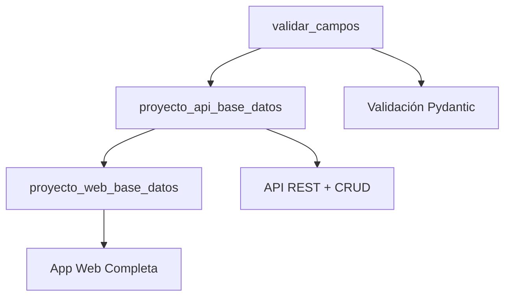

# Ejemplos de Desarrollo Web con FastAPI

Una colección completa de proyectos educativos que muestran la evolución del desarrollo web moderno, desde APIs REST básicas hasta aplicaciones web completas.

## 🎯 Propósito Educativo

Esta colección está diseñada para enseñar **desarrollo web progresivo** usando tecnologías modernas de Python. Los proyectos están organizados en una secuencia lógica que permite aprender paso a paso los conceptos fundamentales del desarrollo backend y frontend.

### 📚 ¿Qué aprenderás?

- **APIs REST** con FastAPI
- **Operaciones CRUD** completas
- **Validación de datos** con Pydantic
- **Bases de datos** con SQLAlchemy
- **Aplicaciones web** con Jinja2
- **Diseño CSS** profesional
- **Arquitectura de software** escalable

## 📁 Estructura de Proyectos

```
ejemplos/
├── README.md                    # 📖 Esta guía
├── proyecto_api_base_datos/     # 🚀 Nivel 1: API REST
├── proyecto_web_base_datos/     # 🌐 Nivel 2: Aplicación Web
└── validar_campos/             # ✅ Nivel 0: Validación Básica
```

## 🛣️ Roadmap de Aprendizaje

### 📊 Progresión Recomendada



### 🎓 Niveles de Dificultad

| Nivel | Proyecto | Conceptos | Duración |
|-------|----------|-----------|----------|
| **0** ⭐ | `validar_campos` | Validación, Formularios | 2-3 horas |
| **1** ⭐⭐ | `proyecto_api_base_datos` | API REST, CRUD, BD | 4-6 horas |
| **2** ⭐⭐⭐ | `proyecto_web_base_datos` | Web App, Templates, CSS | 6-8 horas |

## 📋 Proyectos Detallados

### 🔰 Nivel 0: Validación de Campos
**Directorio**: `validar_campos/`

Un proyecto introductorio que enseña los fundamentos de validación de datos y manejo de formularios web.

#### 🎯 Objetivos de Aprendizaje:
- Validación de datos con Pydantic
- Formularios HTML básicos
- Manejo de errores de validación
- FastAPI básico para formularios

#### 🛠️ Tecnologías:
- FastAPI
- Pydantic
- Jinja2 básico
- HTML/CSS simple

#### 📚 Conceptos Clave:
- Modelos de validación
- Renderizado de plantillas
- Manejo de formularios POST
- Mensajes de error al usuario

---

### 🚀 Nivel 1: API Base de Datos
**Directorio**: `proyecto_api_base_datos/`

Una API REST completa que implementa operaciones CRUD con base de datos.

#### 🎯 Objetivos de Aprendizaje:
- Arquitectura API REST
- Operaciones CRUD completas
- Manejo de base de datos con SQLAlchemy
- Documentación automática con FastAPI

#### 🛠️ Tecnologías:
- FastAPI
- SQLAlchemy
- Pydantic
- SQLite
- SQL Raw

#### 📚 Conceptos Clave:
- Endpoints REST (GET, POST, PUT, DELETE)
- Inyección de dependencias
- Modelos de datos
- Validación de entrada/salida
- Manejo de errores HTTP

#### 📡 Endpoints Principales:
```
POST   /users/           # Crear usuario
GET    /users/           # Listar usuarios
GET    /users/{id}       # Obtener usuario
POST   /users/{id}/items/ # Crear item
GET    /items/           # Listar items
PUT    /items/{id}       # Actualizar item
DELETE /items/{id}       # Eliminar item
```

---

### 🌐 Nivel 2: Aplicación Web Base de Datos
**Directorio**: `proyecto_web_base_datos/`

Una aplicación web completa que evoluciona desde la API, añadiendo interfaz de usuario.

#### 🎯 Objetivos de Aprendizaje:
- Evolución de API a aplicación web
- Templates con Jinja2
- Diseño CSS profesional
- Experiencia de usuario completa

#### 🛠️ Tecnologías:
- FastAPI
- SQLAlchemy (reutilizado)
- Jinja2
- CSS profesional
- HTML semántico

#### 📚 Conceptos Clave:
- Renderizado del lado del servidor
- Formularios HTML avanzados
- Navegación web
- Diseño responsive
- Manejo de sesiones

#### 🎨 Características de Diseño:
- CSS minimalista y profesional
- Sin degradados (diseño limpio)
- Responsive design
- Componentes reutilizables
- Estados de validación visual

## 🚀 Instalación y Configuración Global

### Prerrequisitos
- Python 3.13 o superior
- pip o uv (gestor de paquetes)
- Git (opcional)

### Configuración del Entorno

1. **Clonar/descargar los ejemplos:**
   ```bash
   cd ejemplos
   ```

2. **Crear entorno virtual (recomendado):**
   ```bash
   python -m venv .venv
   source .venv/bin/activate  # Linux/Mac
   # o
   .venv\Scripts\activate     # Windows
   ```

3. **Navegar al proyecto deseado:**
   ```bash
   # Para validación básica
   cd validar_campos
   
   # Para API REST
   cd proyecto_api_base_datos
   
   # Para aplicación web
   cd proyecto_web_base_datos
   ```

4. **Seguir las instrucciones específicas** en cada README.md del proyecto

## 📖 Guías de Estudio

### 🎓 Para Estudiantes

#### Ruta de Aprendizaje Completa:
1. **Semana 1**: `validar_campos`
   - Conceptos básicos de validación
   - Formularios web simples
   
2. **Semana 2**: `proyecto_api_base_datos`
   - API REST desde cero
   - Base de datos y CRUD
   
3. **Semana 3**: `proyecto_web_base_datos`
   - Evolución a aplicación web
   - Interfaz de usuario completa

#### 📝 Entregables Sugeridos:
- **Proyecto 1**: Formulario de validación personalizado
- **Proyecto 2**: API con autenticación básica
- **Proyecto 3**: Aplicación web con nuevas funcionalidades

### 👨‍🏫 Para Instructores

#### Material Didáctico Incluido:
- ✅ **Documentación completa** en cada proyecto
- ✅ **Ejercicios progresivos** con diferentes niveles
- ✅ **Scripts de prueba** automatizados
- ✅ **Ejemplos de código** ejecutables
- ✅ **Comparaciones educativas** entre enfoques

#### Estructura de Clase Sugerida:
```
Clase 1-2: Conceptos + validar_campos
Clase 3-4: API REST + proyecto_api_base_datos
Clase 5-6: Web App + proyecto_web_base_datos
Clase 7-8: Integración y proyecto final
```

### 🏠 Para Autodidactas

#### Estrategia de Estudio:
1. **Lee primero** el README completo de cada proyecto
2. **Ejecuta los ejemplos** para ver cómo funcionan
3. **Modifica el código** experimentando
4. **Completa los ejercicios** propuestos
5. **Crea tu propio proyecto** combinando conceptos

## 🔧 Herramientas de Desarrollo

### IDEs Recomendados:
- **VS Code** con extensiones Python y FastAPI
- **PyCharm** Professional o Community
- **Sublime Text** con plugins Python

### Extensiones Útiles (VS Code):
- Python
- Pylance
- Thunder Client (para probar APIs)
- Jinja2
- SQLite Viewer

### Herramientas de Testing:
- **curl** - Línea de comandos
- **Postman** - GUI para APIs
- **httpx** - Testing programático
- **pytest** - Testing automatizado

### Control de Versiones:
- **Git** configurado con .gitignore completo
- Scripts de verificación incluidos:
  - `sync_gitignore.sh` - Sincronizar .gitignore en todos los proyectos
  - `check_gitignore.sh` - Verificar configuración

#### 📋 Archivos Ignorados Automáticamente:
- `__pycache__/` y `*.pyc` (Python compilado)
- `.venv/` (Entornos virtuales)
- `*.db`, `*.sqlite` (Bases de datos)
- `.env` (Variables de entorno)
- `*.log` (Archivos de log)
- `.vscode/`, `.idea/` (Configuración IDEs)
- Archivos temporales del sistema

## 📊 Comparación de Proyectos

| Aspecto | Validar Campos | API Base Datos | Web Base Datos |
|---------|----------------|----------------|----------------|
| **Complejidad** | Básica | Intermedia | Avanzada |
| **Líneas de código** | ~200 | ~500 | ~800 |
| **Archivos** | 3-4 | 6-7 | 10-12 |
| **Conceptos** | 5 | 12 | 20+ |
| **Tiempo aprox.** | 2-3h | 4-6h | 6-8h |
| **Dependencias** | 2 | 3 | 4 |

## 🎯 Casos de Uso Reales

### Aplicaciones Similares en el Mundo Real:

#### `validar_campos` se usa en:
- 📝 Formularios de contacto
- 🔐 Formularios de registro
- 📊 Encuestas online
- ✅ Validación de datos

#### `proyecto_api_base_datos` se usa en:
- 📱 APIs para apps móviles
- 🔌 Microservicios
- 🤖 Integración con sistemas
- 📡 APIs públicas

#### `proyecto_web_base_datos` se usa en:
- 🏢 Aplicaciones empresariales
- 📋 Sistemas de gestión
- 🛒 E-commerce básico
- 👥 Portales de usuarios

## 🚧 Extensiones Propuestas

### Proyectos Adicionales Sugeridos:

#### 🔐 **Autenticación y Autorización**
- Login/logout
- JWT tokens
- Roles de usuario
- Sesiones seguras

#### 📱 **API + Frontend Separado**
- API backend
- React/Vue frontend
- Comunicación AJAX
- SPA (Single Page Application)

#### 🐳 **Containerización**
- Docker containers
- docker-compose
- Despliegue automatizado
- CI/CD básico

#### 📊 **Analytics y Monitoring**
- Logging avanzado
- Métricas de uso
- Dashboard de admin
- Health checks

## 🐛 Troubleshooting Común

### Problemas Frecuentes:

#### Error: "ModuleNotFoundError"
```bash
# Solución: Activar entorno virtual
source .venv/bin/activate
pip install -r requirements.txt
```

#### Error: "Port already in use"
```bash
# Solución: Cambiar puerto
uvicorn main:app --port 8001
```

#### Error: "Database locked"
```bash
# Solución: Cerrar otras conexiones
pkill -f "python.*main.py"
```

#### Error CSS no carga
```bash
# Verificar ruta de archivos estáticos
# Revisar configuración en main.py
```

## 🤝 Contribución

### Cómo Contribuir:
1. **Fork** el repositorio
2. **Crea** una rama para tu feature
3. **Mejora** la documentación o código
4. **Prueba** todos los ejemplos
5. **Envía** un pull request

### Áreas de Mejora:
- 📚 Más ejemplos de código
- 🧪 Tests adicionales
- 📖 Documentación más clara
- 🎨 Mejores estilos CSS
- 🔧 Más ejercicios prácticos

## 📄 Licencia

Proyectos educativos de código abierto bajo licencia MIT.

## 🎉 ¡Felicitaciones!

Si completas todos los proyectos, habrás aprendido:

- ✅ **Desarrollo backend** con FastAPI
- ✅ **Manejo de bases de datos** con SQLAlchemy
- ✅ **APIs REST** profesionales
- ✅ **Aplicaciones web** completas
- ✅ **Validación de datos** robusta
- ✅ **Diseño web** moderno
- ✅ **Arquitectura de software** escalable

## 🚀 Siguientes Pasos

Después de completar estos ejemplos, estarás listo para:

1. **Proyectos más complejos** con autenticación
2. **Microservicios** y arquitecturas distribuidas
3. **Deployment** en la nube (AWS, GCP, Azure)
4. **Frontend frameworks** (React, Vue, Angular)
5. **DevOps** y CI/CD pipelines

---

## 📞 Soporte

¿Tienes preguntas? ¿Encontraste un error?

- 📖 Revisa la documentación específica de cada proyecto
- 🔍 Busca en los archivos EJEMPLOS.md para casos de uso
- 🧪 Ejecuta los scripts de prueba incluidos
- 💡 Revisa los EJERCICIOS.md para práctica adicional

**¡Buen aprendizaje! 🎓✨**
