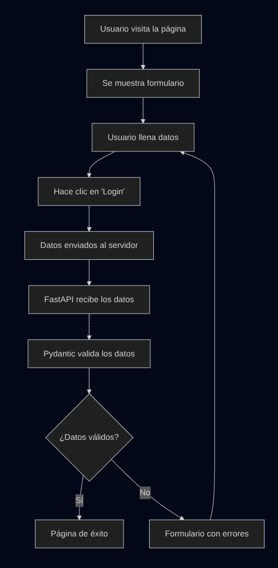

# 🎓 Proyecto Educativo: Validación de Formularios con FastAPI y Pydantic

¡Bienvenido al proyecto más completo para aprender validación de formularios web! Este proyecto está diseñado específicamente para estudiantes de grado 11.

## 🎯 ¿Qué vas a aprender?

### Conceptos Fundamentales
- ✅ **Validación de datos en el backend** - Por qué es crucial para la seguridad
- 🌐 **Arquitectura cliente-servidor** - Cómo interactúa el navegador con el servidor
- 📝 **Formularios HTML** - Estructura y atributos importantes
- 🎨 **CSS moderno** - Diseño responsivo y efectos visuales
- 🔄 **Plantillas dinámicas** - Cómo generar HTML con datos de Python

### Tecnologías Utilizadas
- 🚀 **FastAPI** - Framework web moderno y rápido
- 🛡️ **Pydantic** - Validación automática de datos
- 🎨 **Jinja2** - Motor de plantillas para HTML dinámico
- 📱 **HTML/CSS** - Frontend responsivo y atractivo

## 📁 Estructura del Proyecto

Cuando descargas el proyecto desde GitHub, obtienes esta estructura limpia:

```
validar_campos/
├── 📄 main.py                 # ⭐ Aplicación principal FastAPI
├── 🏗️ modelos_pydantic.py     # ⭐ Modelos de datos y validaciones
├──  README.md                 # ⭐ Este archivo (documentación)
├── 📁 templates/              # ⭐ Plantillas HTML
│   ├── 🔐 login.html          #    Formulario de login
│   └── 🎉 everythingok.html   #    Página de éxito
└── 📁 static/                 # ⭐ Archivos estáticos
    └── 🎨 form_styles.css     #    Estilos del formulario
```

## 🚀 Instalación y Ejecución

### Prerrequisitos
- Python 3.8+ instalado en tu computadora
- Git instalado (para descargar el proyecto)
- Terminal o línea de comandos

### 📥 Paso 1: Descargar el Proyecto

**Opción A: Clonar desde GitHub (recomendado)**
```bash
# Clona el repositorio
git clone [URL_DEL_REPOSITORIO]
cd validar_campos
```

**Opción B: Descargar ZIP**
1. Ve al repositorio en GitHub
2. Haz clic en el botón verde "Code"
3. Selecciona "Download ZIP"
4. Extrae el archivo y navega a la carpeta

### 🛠️ Paso 2: Configurar el Entorno Virtual

Es importante crear un entorno virtual para mantener las dependencias organizadas:

```bash
# Crear entorno virtual
python -m venv venv

# Activar el entorno virtual
# En Windows:
venv\Scripts\activate

# En macOS/Linux:
source venv/bin/activate
```

### 📦 Paso 3: Instalar las Dependencias

```bash
# Instalar FastAPI con todas las dependencias estándar (¡Recomendado!)
pip install "fastapi[standard]"
```

**💡 ¿Qué incluye `fastapi[standard]`?**
- `fastapi` - El framework web principal
- `uvicorn` - Servidor web de alto rendimiento
- `pydantic[email]` - Validación automática de datos con soporte para emails
- `jinja2` - Motor de plantillas para HTML dinámico
- `python-multipart` - Para manejar formularios HTML
- `httpx` - Cliente HTTP para hacer peticiones
- Y muchas otras dependencias útiles

**✨ Ventaja:** Una sola instalación incluye todo lo necesario para desarrollo web moderno.

### 🎯 Paso 4: Ejecutar la Aplicación

```bash
# Ejecutar el servidor de desarrollo (¡Súper fácil!)
fastapi dev main.py
```

**🚀 ¿Por qué `fastapi dev`?**
- Comando simple y fácil de recordar
- Reinicio automático cuando modificas el código
- Configuración optimizada para desarrollo
- ¡No necesitas recordar parámetros complicados!

### 🌐 Paso 5: Acceder a la Aplicación

1. **Abre tu navegador web**
2. **Ve a:** `http://localhost:8000`
3. **¡Listo!** Ya puedes experimentar con el formulario

### 💡 ¿Por qué `fastapi dev` es mejor?

**🆚 Comparación con métodos anteriores:**

| Aspecto | `fastapi dev main.py` | `uvicorn main:app --reload` |
|---------|----------------------|----------------------------|
| **Simplicidad** | ✅ Súper simple | ❌ Más complejo de recordar |
| **Configuración** | ✅ Automática | ❌ Manual |
| **Debugging** | ✅ Optimizado | ⚠️ Básico |
| **Velocidad** | ✅ Más rápido | ⚠️ Estándar |
| **Mensajes de error** | ✅ Más claros | ⚠️ Técnicos |

**🎯 Ventajas para estudiantes:**
- **Fácil de recordar**: Un solo comando simple
- **Menos errores**: No necesitas recordar parámetros
- **Mejor experiencia**: Mensajes más amigables
- **Futuro-proof**: Es la forma moderna recomendada

### 🔧 Comandos Adicionales Útiles

```bash
# Ver ayuda de FastAPI
fastapi --help

# Ejecutar en un puerto diferente
fastapi dev main.py --port 8001

### 🚨 Solución de Problemas Comunes

**Error: "Command not found: fastapi"**
```bash
# Asegúrate de que el entorno virtual esté activado
source venv/bin/activate  # macOS/Linux
# o
venv\Scripts\activate     # Windows

# Luego reinstala FastAPI
pip install "fastapi[standard]"
```

**Error: "Port already in use"**
```bash
# Usa un puerto diferente
fastapi dev main.py --port 8001
```

**Error: "ModuleNotFoundError"**
```bash
# Verifica que FastAPI esté instalado correctamente
pip show fastapi

# Si no está instalado o falta algo:
pip install "fastapi[standard]"
```

## 🧪 Casos de Prueba para Aprender

### ✅ Casos Exitosos
Prueba estos datos para ver cuando todo funciona bien:
- **Email:** `estudiante@colegio.edu`
- **Contraseña:** `mipasword123`

### ❌ Casos de Error
Prueba estos datos para ver la validación en acción:

| Caso | Email | Contraseña | Error Esperado |
|------|-------|------------|----------------|
| Email inválido | `usuario.com` | `password123` | "Enter a valid email address" |
| Sin @ | `usuario` | `password123` | "Enter a valid email address" |
| Contraseña corta | `test@test.com` | `123` | "La contraseña debe tener al menos 8 caracteres." |
| Campos vacíos | *(vacío)* | *(vacío)* | "This field is required" |

## 🔍 Análisis del Código

### 1. 📄 main.py - El Corazón de la Aplicación

```python
# Ruta principal - Muestra el formulario
@app.get("/")
async def mostrar_formulario_login(request: Request):
    # Renderiza login.html sin errores
```

```python
# Ruta de procesamiento - Valida los datos
@app.post("/login/")
async def procesar_login(request: Request, email: str, password: str):
    try:
        # Intenta crear un usuario (aquí ocurre la validación)
        usuario = User(email=email, password=password)
        # Si llega aquí, todo está bien
    except ValidationError as e:
        # Si hay errores, los procesa y muestra al usuario
```

### 2. 🏗️ modelos_pydantic.py - Las Reglas de Validación

```python
class User(BaseModel):
    email: EmailStr        # Valida formato de email automáticamente
    password: str          # Campo de texto obligatorio
    
    @field_validator('password')
    def validar_longitud_password(cls, valor):
        # Validación personalizada: mínimo 8 caracteres
```

### 3. 🎨 Templates - HTML Dinámico

```html
<!-- Muestra errores solo si existen -->

    <div class="error">⚠️ {{ errors['email'] }}</div>

```

## 🔄 Flujo de la Aplicación



Este diagrama muestra exactamente cómo funciona la validación paso a paso:

1. **👤 Usuario visita la página** → Se muestra el formulario vacío
2. **📝 Usuario llena los datos** → Escribe email y contraseña  
3. **🖱️ Hace clic en 'Login'** → Se envían los datos al servidor
4. **📡 Datos enviados al servidor** → FastAPI recibe la petición POST
5. **🔍 FastAPI recibe los datos** → Se extraen email y password del formulario
6. **🛡️ Pydantic valida los datos** → Se verifica formato y reglas
7. **❓ ¿Datos válidos?** → Aquí se decide el camino a seguir
   - **✅ Sí → Página de éxito** → Todo perfecto, usuario validado
   - **❌ No → Formulario con errores** → Se muestran los problemas específicos
8. **🔄 Vuelta al formulario** → Si hay errores, el usuario puede corregir

**🎯 Puntos clave del flujo:**
- La validación ocurre en el **servidor**, no solo en el navegador
- Los errores son **específicos** y **útiles** para el usuario
- El formulario **conserva** los datos válidos y solo marca los errores
- Es un **ciclo**: el usuario puede corregir y volver a intentar

## 🧠 Conceptos Clave para Estudiantes

### 🛡️ ¿Por qué validar en el backend?

**Nunca confíes solo en la validación del frontend:**
- El usuario puede deshabilitar JavaScript
- Pueden modificar el HTML en el navegador
- Pueden enviar datos directamente al servidor
- **La validación del backend es tu última línea de defensa**

### 📝 Tipos de Validación

1. **Validación del Navegador (Frontend)**
   ```html
   <input type="email" required minlength="8">
   ```
   - Buena experiencia de usuario
   - Feedback inmediato
   - **NO es suficiente para seguridad**

2. **Validación del Servidor (Backend)**
   ```python
   email: EmailStr  # Pydantic valida automáticamente
   ```
   - Seguridad real
   - Control total
   - **Siempre necesaria**

### 🔄 El Patrón MVC (Modelo-Vista-Controlador)

- **Modelo** (`modelos_pydantic.py`): Define la estructura de datos
- **Vista** (`templates/`): Presenta la información al usuario
- **Controlador** (`main.py`): Maneja la lógica de la aplicación

## 🎮 Ejercicios Propuestos

### Nivel Principiante
1. **Agrega un campo "nombre"** al formulario y modelo
2. **Cambia el mensaje de error** de la contraseña
3. **Modifica los colores** del CSS

### Nivel Intermedio
4. **Agrega validación de edad** (debe ser mayor a 13)
5. **Implementa confirmación de contraseña** (ambas deben coincidir)
6. **Agrega un campo de selección** (país, por ejemplo)

### Nivel Avanzado
7. **Implementa diferentes tipos de usuarios** (estudiante, profesor)
8. **Agrega una base de datos** con SQLite
9. **Implementa autenticación JWT** real

## 🔧 Personalización

### Cambiar Validaciones
En `modelos_pydantic.py`:
```python
@field_validator('password')
def validar_password_segura(cls, valor):
    # Agregar más reglas de validación
    if not any(c.isupper() for c in valor):
        raise ValueError('Debe tener al menos una mayúscula')
    return valor
```

### Cambiar Estilos
En `static/form_styles.css`:
```css
:root {
    --color-primary: #ff6b6b;  /* Cambia a rojo */
    --color-background: #f8f9fa; /* Cambia el fondo */
}
```

## 🐛 Solución de Problemas

### Error: "ModuleNotFoundError"
```bash
# Asegúrate de que el entorno virtual esté activado
source venv/bin/activate  # macOS/Linux
# o
venv\Scripts\activate     # Windows

# Instala FastAPI con todas las dependencias
pip install "fastapi[standard]"
```

### Error: "Port already in use"
```bash
# Usa un puerto diferente
fastapi dev main.py --port 8001
```

### Error: "Template not found"
```bash
# Verifica que las carpetas existan:
# - templates/ (con login.html y everythingok.html)
# - static/ (con form_styles.css)
```

### Error: "Permission denied" (macOS/Linux)
```bash
# Dale permisos de ejecución al script
chmod +x iniciar_proyecto.py
python iniciar_proyecto.py
```

### ⚠️ Nota Importante sobre Entornos Virtuales
**Siempre activa el entorno virtual antes de trabajar:**
```bash
# Activar entorno virtual
source venv/bin/activate  # macOS/Linux
venv\Scripts\activate     # Windows

# Cuando termines, puedes desactivarlo
deactivate
```

## 📚 Recursos Adicionales

### Documentación Oficial
- [FastAPI](https://fastapi.tiangolo.com/es/) - Framework web
- [Pydantic](https://pydantic.dev/) - Validación de datos
- [Jinja2](https://jinja.palletsprojects.com/) - Motor de plantillas

### Tutoriales Recomendados
- [FastAPI Tutorial Oficial](https://fastapi.tiangolo.com/es/tutorial/)
- [Pydantic Getting Started](https://pydantic.dev/latest/usage/models/)
- [HTML Forms MDN](https://developer.mozilla.org/es/docs/Web/HTML/Element/form)
- [Python Virtual Environments](https://docs.python.org/3/tutorial/venv.html)

### Videos Educativos
- Busca "FastAPI tutorial" en YouTube
- "Pydantic validation tutorial"
- "HTML forms explained"
- "Python virtual environments tutorial"

### 🎓 Comandos de Pip Útiles
```bash
# Ver paquetes instalados
pip list

# Ver información de FastAPI
pip show fastapi

# Actualizar FastAPI
pip install --upgrade "fastapi[standard]"

# Crear archivo de requisitos
pip freeze > requirements.txt

# Instalar desde archivo de requisitos
pip install -r requirements.txt

# Ver qué incluye fastapi[standard]
pip show fastapi uvicorn pydantic jinja2
```

## 🤝 Contribuir al Proyecto

¿Encontraste un error o tienes una sugerencia? ¡Excelente!
1. Describe el problema o mejora
2. Propón una solución
3. Prueba tu código
4. Documenta los cambios

## 📄 Licencia

Este proyecto es de uso educativo y está disponible para cualquier estudiante o profesor que quiera aprender o enseñar desarrollo web.

## 👨‍🏫 Para Profesores

### Objetivos de Aprendizaje
- Comprender la importancia de la validación de datos
- Aprender arquitectura cliente-servidor
- Practicar conceptos de seguridad web
- Usar herramientas modernas de desarrollo

### Evaluación Sugerida
- **Básico:** Modificar validaciones existentes
- **Intermedio:** Agregar nuevos campos con validaciones
- **Avanzado:** Implementar funcionalidades adicionales

### Tiempo Estimado
- **Explicación:** 2-3 horas
- **Práctica:** 4-6 horas
- **Ejercicios:** 3-5 horas

---

**¡Feliz aprendizaje! 🚀** Si tienes preguntas, no dudes en experimentar con el código. ¡La mejor forma de aprender programación es programando!